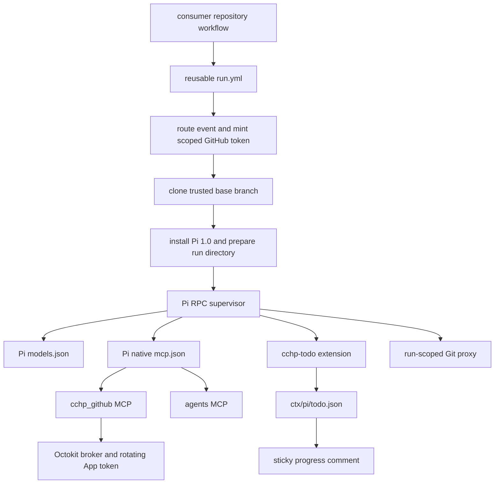

# Pi agent toolchain and CCHP runtime contract

## Runtime topology

One GitHub event receives one run-owned directory. The workflow keeps ownership
of routing, GitHub token minting, checkout, dependency preparation, progress
finalization, lifecycle evidence, and cleanup. Pi owns the model loop and its
tool execution. The Pi process receives the task prompt, the rendered trusted
system instructions, and only the MCP servers declared for the current run.

The caller ABI remains stable:

- `default_branch`, `roadmap_project`, `roadmap_policy`, `semver_workflow`,
  `semver_marker`, `tech_stack`, and `languages` remain workflow inputs.
- `app-client-id`, `app-private-key`, `provider-keys`, `heroui-token`, and
  `see-api-key` remain reusable-workflow secrets.
- `CCHP_BOT_PROVIDERS`, `CCHP_BOT_MODEL`, `CCHP_BOT_SMALL_MODEL`,
  `CCHP_BOT_EXTRA_INSTRUCTIONS`, and `CCHP_DISABLE_AUTO_APPROVE` remain caller
  variables. `CCHP_BOT_OPENCODE_VERSION` is accepted as a legacy ignored field.

## Pi installation and isolation

`scripts/install-pi.sh` installs the pinned `@earendil-works/pi-coding-agent@1.0.0`
package into `${BOT_WORKDIR}/pi-install` with `npm --ignore-scripts`. It checks
Node.js 22.19 or newer, verifies `pi --version`, and exports the absolute binary
as `PI_BIN`. Pi starts with the following run-scoped settings:

- `PI_CODING_AGENT_DIR=${BOT_WORKDIR}/pi-home`
- `PI_OFFLINE=1`, `PI_SKIP_VERSION_CHECK=1`, and `PI_TELEMETRY=0`
- `defaultProjectTrust=always` for the trusted checkout
- a session directory under `${BOT_WORKDIR}/ctx/pi/sessions`
- the first-party CCHP todo extension loaded from `pi/extensions/cchp-todo.ts`

The workflow does not reuse user-level Pi credentials, sessions, packages, or
models. The run directory is removed by the existing authenticated cleanup
stage after the final lifecycle artifact has completed its round trip.

## Provider and model adapter

`src/pi/providers.ts` accepts the caller provider object and normalizes each
provider into Pi's `models.json` format. The adapter maps `anthropic`,
`openai-compatible`, and `openai-responses` to Pi's native API identifiers and
passes through a custom Pi API identifier for a provider extension. Model
metadata supports context size, output limit, reasoning, image input, cost,
thinking-level maps, and compatibility flags.

`CCHP_BOT_MODEL` and `CCHP_BOT_SMALL_MODEL` use the existing `provider/model`
reference form. The adapter does not impose a model name or a model generation;
the next provider configuration can select the current models supplied by the
CCHP deployment.

Provider keys and header values become environment references in `models.json`.
The generated JSON contains no raw credential. The CCHP GitHub broker token is
also referenced from the Pi MCP configuration and is rotated by the parent
process.

Providers using the existing OpenAI Responses, OpenAI-compatible, or Anthropic
wire formats are routed through the run-owned loopback provider bridge. Pi sees
the bridge token and a provider/model catalog; the parent process keeps the raw
provider credentials and performs protocol conversion upstream. A provider using
a Pi-specific API or custom streaming extension remains a direct Pi provider and
must supply its own reviewed provider extension.

Custom protocols use a Pi provider extension. A provider extension can register
`pi.registerProvider()` with a native API, custom streaming, model discovery,
OAuth, request filtering, or compatibility normalization. This keeps provider
specific behavior in the provider adapter while the caller contract stays
stable.

## Native MCP and GitHub operations

Pi reads a run-owned `mcp.json` containing direct `cchp_github` and `agents`
stdio servers. The first server is the existing Octokit-backed CCHP MCP
implementation. Its task allow list, trusted target binding, review
finalization gate, fork restrictions, artifact validation, and token rotation
remain in the server and broker. The second server starts Pi child sessions for
independent review and verification passes, records their terminal feedback,
and enforces one delegation depth. Optional servers may use Pi's `tool_search`
surface.

The optional `see_upload` server uses the same broker token and run-owned paths.
The Git proxy remains available for trusted write tasks, so Pi can push through
the repository-scoped endpoint without receiving the installation token in its
Git configuration.

## RPC lifecycle and progress

`src/pi/rpc.ts` uses strict LF-delimited JSON records. It sends one `prompt`
command, consumes all events until `agent_settled`, records the event stream,
captures the authoritative assistant message, and closes Pi's stdin for an
orderly shutdown. Provider errors and unexpected process exits become a failed
run outcome.

`pi/extensions/cchp-todo.ts` provides a `todo` tool and `/todos` command. Each
replacement writes the complete list to `ctx/pi/todo.json`. The Pi runtime
watches that file and updates the existing CCHP sticky progress marker while
the agent is working. The ledger uses the existing `pending`, `in_progress`,
`completed`, and `cancelled` statuses.

The runtime writes a Pi terminal record and a compatibility projection consumed
by the lifecycle finalizer. The final sticky comment uses the shared terminal
renderer and omits token counters. Same-repository pull request reviews may
run repository checks and tests in the trusted checkout; fork reviews use the
pre-fetched context and typed tools.

## CCH integration path

The current consumer is `CCH-HQ/claude-code-hub-plus` on its `dev` branch. Its
`.github/workflows/cchp-bot.yml` keeps the event matrix, concurrency gates,
permissions, and secret mapping, then calls
`CCH-HQ/cchp-automation/.github/workflows/run.yml@latest`. The current caller
sets `default_branch=dev`, `roadmap_project=1`, the roadmap policy path, and the
Go/React technology overlay. The reusable workflow checks out the engine at the
resolved workflow commit, clones the consumer's trusted `dev` branch, reads the
consumer variables and passed secrets, then runs Pi inside the isolated runner
directory.

At the current GitHub state, the consumer repository reports
`cchp-automation bot` as `disabled_manually`; its repository variables
`CCHP_BOT_MODEL` and `CCHP_BOT_PROVIDERS` are present. Their values remain
untouched until the new provider configuration is supplied. The caller still
has `CCHP_APP_CLIENT_ID`, `CCHP_APP_PRIVATE_KEY`, `CCHP_BOT_PROVIDER_KEYS`,
`HEROUI_AUTH_TOKEN`, and `SEE_API_KEY` secrets available for the reusable
workflow.

The CCH Hub service supplies provider endpoints and credentials through the
consumer's `CCHP_BOT_PROVIDERS` and `CCHP_BOT_PROVIDER_KEYS` values. CCHP
chooses the provider and model before Pi starts. Pi sends the normalized request
to the selected provider endpoint, while GitHub reads and mutations flow through
the CCHP broker. A new provider configuration is therefore a configuration
change in the consumer repository; it does not require a workflow rewrite.

CCHP Plus is delivered as a single gateway image with dashboard, gateway, and
migrations. Its documented local deployment exposes the dashboard on port 8080
and the gateway on port 8081. The gateway natively accepts OpenAI Responses,
OpenAI-compatible Chat Completions, Anthropic Messages, and Gemini requests, so
the Pi bridge can keep the caller's selected wire format while the gateway
performs its own provider routing and normalization.

The consumer's checked-in runbook still describes the previous Codex cutover;
the CCH workflow remains manually disabled until the new provider configuration
is supplied. Re-enabling and testing that caller is the next external step after
the Pi engine receives `CCHP_BOT_PROVIDERS`, `CCHP_BOT_MODEL`, and the matching
`CCHP_BOT_PROVIDER_KEYS` secret.
